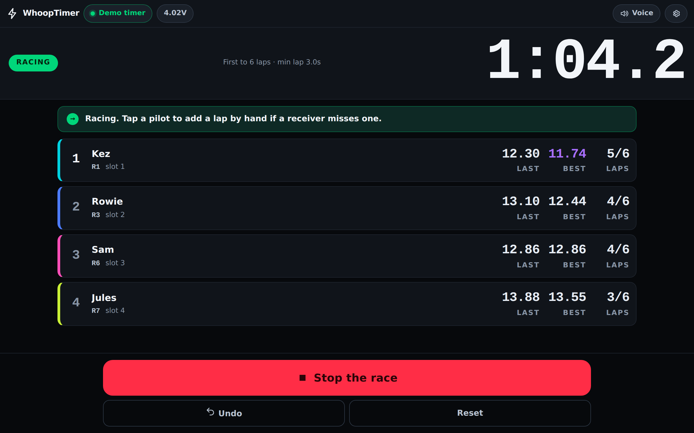
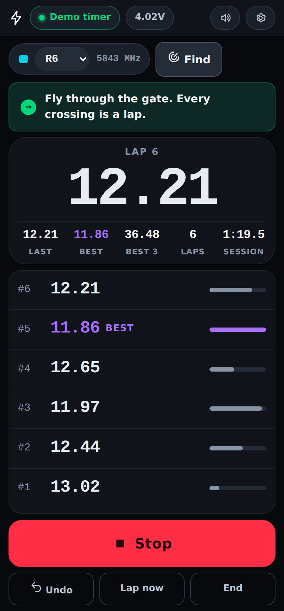
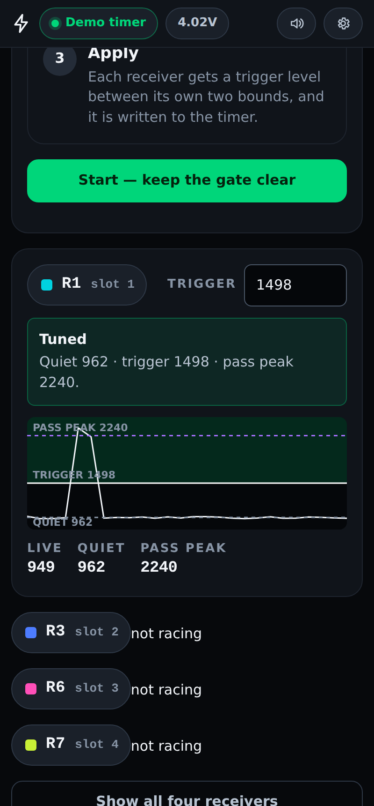

# WhoopTimer

Race timing for an **ImmersionRC LapRF**, built for indoor whoop racing.

**[whooptimer.webfpv.org](https://whooptimer.webfpv.org)** — open it, switch your
timer on, connect. There is nothing to install.

The page talks to the timer itself over Web Bluetooth, so the browser holds the
protocol, the race and your saved sessions. Nothing is uploaded, no account
exists, and once you have opened it once it works with no internet at all — which
matters, because a track is exactly where there is no signal.



<p align="center">
  
  
</p>

## Two things it does

**Fly on your own.** Pick your video channel — or tap *Find my channel* and the
timer sweeps all forty and tells you which one your quad is on. Tap **Start**.
Every gate crossing lands as a big lap time and is read out loud: *"Lap 3, 24.7."*
Best lap and best three consecutive keep score. That is the whole interface.

**Run a race.** Switch on the pilots, name them, set the format, arm it. A
countdown, then an F1-style timing tower that reorders live, purple for the
session's fastest lap, spoken callouts, last-lap and winner announcements, undo
for a lap that should not have counted, and results saved to history with CSV
export.

Whichever you are doing, a line above the main button always says the one thing
to do next — and if the timer physically cannot detect a lap, it says so instead
of letting you fly a session that records nothing.

## Which browser

Connecting from a web page needs Web Bluetooth, which is a real constraint worth
knowing before you get to a track:

| | direct connect | what to do otherwise |
|---|---|---|
| Chrome / Edge, desktop | ✅ Bluetooth and USB | |
| Chrome, Android | ✅ Bluetooth | |
| Safari, iPhone / iPad | ❌ | use [Bluefy](https://apps.apple.com/app/bluefy-web-ble-browser/id1492822055), or the local app below |
| Firefox | ❌ | use the local app below |

The connect screen works this out for you and says which of these applies,
rather than failing quietly.

No timer yet? **Try it without a timer** on the connect screen runs a simulated
one, and every screen works.

## Running it locally

You do not need this to use WhoopTimer. It exists for two cases: a browser with
no Web Bluetooth, and putting the app on a phone or tablet at the track without
that device needing Bluetooth support of its own.

```bash
git clone https://github.com/Mathew-Harvey/WhoopRaceTimer.git
cd WhoopRaceTimer
pip install -r requirements.txt
./whooptimer
```

or `python3 server.py --open`, then open **http://127.0.0.1:8080**.

It serves the same app and holds the radio link itself, relaying raw frames to
the page. **Never needs root.**

### From a phone or tablet

```bash
./whooptimer --lan
```

```
WhoopTimer -> http://127.0.0.1:8080
            on this network: http://192.168.1.42:8080
```

Open that address on any device on the same wifi. Because the page is served
from the same machine that owns the link, the device itself needs no Bluetooth
support — this is the iPhone answer.

There is no authentication, so anyone on that network can control the race. Fine
for a club night; not for public wifi.

### Optional: USB permissions on Linux

Bluetooth is the control transport and needs no special permissions. USB is a
fallback. If you want it and hit a permissions error:

```bash
sudo cp contrib/99-laprf.rules /etc/udev/rules.d/
sudo udevadm control --reload-rules && sudo udevadm trigger
```

That grants access to whoever is logged in at the machine — no group changes, no
logout. Alternatively add yourself to the serial group (`uucp` on Arch, `dialout`
on Debian/Ubuntu) and log back in.

## Voice callouts

Callouts use the browser's own speech synthesis, so they need nothing installed
— **except on Linux**, where browsers route the Web Speech API through
`speech-dispatcher`. Without it `speechSynthesis` fails *silently*:

```bash
sudo apt install speech-dispatcher     # or: pacman -S speech-dispatcher
```

Restart the browser afterwards; voices are enumerated at startup. If the browser
reports no voices the app says so in the voice panel rather than pretending to
speak, and every callout still appears on screen.

You can have the full callout, just the number, or silence.

## Connecting

Control is over **Bluetooth LE**. The timer exposes a Nordic UART Service:

```
service      6e400001-b5a3-f393-e0a9-e50e24dcca9e
control pt   6e400002-b5a3-f393-e0a9-e50e24dcca9e   (write without response, 20-byte chunks)
stream       6e400003-b5a3-f393-e0a9-e50e24dcca9e   (notify)
```

**The timer only advertises for a window after power-on.** Not after a
disconnect, and the bind button does not trigger it. If the link drops, power
cycle the timer — it reconnects in about a second. This is the answer to almost
every "it isn't showing up".

On the unit this was developed against, USB is a **read-only ASCII debug
console**: it prints noise and battery voltage every 2.4 s, ignores everything
sent to it including the documented `Upp\r\n` binary-enable sequence, and carries
no passing records. The app detects that and says the USB link can show signal
but will never time a lap.

## Gate sensitivity

The timer reports a lap when a receiver's RSSI rises **above its threshold**.
Correct placement is between two per-slot bounds:

```
floor (quiet noise)  ....  threshold  ....  ceiling (peak of a real pass)
```

The timer this was written for had **never reported a lap**. Its threshold was
700 while its own noise floor sat at 963 — so it believed a craft was permanently
in the gate, never saw a crossing, and never emitted a passing record. The
receivers were fine the whole time.

That is not an obvious failure, and nothing in the stock tooling says "this slot
can never detect a lap". So this app makes gate sensitivity the thing it explains
best. It states the verdict for every receiver in words, refuses to write a
threshold it can prove will not work, and will not let you start a race with a
receiver in that state without telling you first.

Each receiver is on its own frequency, so **each slot has its own pair** — which
matters most on tiny tracks, where every quad is near the gate all the time and
neighbouring video bleeds across channels.

The wizard on the Gate screen does it in three steps: measure the quiet floor,
fly one pass, apply. Track type biases where in the span the threshold lands:

| preset | fraction | use when |
|---|---|---|
| Tiny | 0.62 | quads are never far from the gate |
| Small indoor | 0.50 | small track |
| Normal | 0.42 | default |
| Open/outdoor | 0.32 | weak or distant passes |

If a slot's floor and ceiling are closer than 120 counts, the app refuses to
derive a threshold and says why, rather than inventing one that will misfire.

## Racing

- **Formats** — open practice, first to N laps, fixed time, or best consecutive laps
- **Timing tower** — live reordering, purple for session-fastest, F1-style
- **Voice callouts** — pilot name, lap number and time. With a single pilot it
  detects that and drops the name: *"Lap 3, 24.7"*
- **Minimum lap time** — enforced in the app as well as on the timer; essential
  for whoops, since one hovering in the gate otherwise racks up a dozen laps
- **Manual gate triggers** — keys `1`–`4`, or tap a pilot's row; a real backup
  when a receiver misses a pass
- **Undo** — removes the last lap and rewinds the timing reference
- Results, session bests and history, with CSV export

Everything persists in the browser, so a reload never resets your pilots,
channels or thresholds.

## Keyboard

| key | |
|---|---|
| `Space` | start / stop |
| `1`–`4` | log a lap by hand for that pilot |
| `U` | undo the last lap |
| `G` | gate and signal |
| `H` | history |
| `Esc` | back to the session |

## How it is put together

The browser is the whole application. The Python server is a byte pipe and a
file server; it does not decode the protocol and holds no state worth losing.

| file | what |
|---|---|
| `static/js/laprf.js` | LapRF binary protocol: CRC-16, escaping, record encode/decode, channel tables |
| `static/js/link.js` | transports — Web Bluetooth, Web Serial, local bridge, and a simulator |
| `static/js/race.js` | race state machine, lap timing, formats, callout text |
| `static/js/tuning.js` | gate bounds and threshold derivation, signal tracking, channel scan |
| `static/js/app.js` | controller: link lifecycle, timer config, and the next-step guidance |
| `static/js/screens.js` | every screen |
| `static/sw.js` | offline cache, so it opens at a track with no signal |
| `laprf.py` | the reference protocol implementation the JavaScript is tested against |
| `ble.py`, `device.py` | raw Bluetooth and serial transports for the local bridge |
| `server.py` | static file server plus `/bridge/*` |

`laprf.py` is no longer on the running path, but it is the implementation that
was cross-checked against three independent decoders, so it stays as the
reference. `tests/test_protocol_parity.py` generates vectors from it and asserts
the JavaScript agrees byte for byte — a divergence between the two would
otherwise be invisible until a race silently recorded nothing.

```bash
python3 tests/test_protocol_parity.py
```

## Hosting your own

`static/` is the entire site — no build step. Push to `main` and
`.github/workflows/pages.yml` publishes it to GitHub Pages, which serves
`static/CNAME` (`whooptimer.webfpv.org`) over HTTPS. HTTPS is not optional: Web
Bluetooth and Web Serial only exist in a secure context.

To point a subdomain at it, add one DNS record at your registrar:

```
whooptimer.webfpv.org.   CNAME   mathew-harvey.github.io.
```

then set the same name under the repository's **Settings → Pages → Custom
domain** and tick *Enforce HTTPS*. The apex `webfpv.org` is independent — it can
serve a different site from a different repository or host entirely, and each
extra app gets its own subdomain the same way.

Any static host works: `netlify deploy --dir static`, `vercel deploy static`,
Cloudflare Pages, or a plain `nginx` root. The only requirements are HTTPS and
that `sw.js` and `manifest.webmanifest` are served from the site root.

## Protocol notes

Record framing is `SOR(0x5A) | length u16le | crc u16le | recordType u16le |
fields | EOR(0x5B)`, where length counts the whole record and the CRC is CRC-16
(reflected poly `0x8005`, init 0) over the record with the CRC field zeroed.
Escaping is applied last: interior bytes equal to `0x5A/0x5B/0x5C` become `0x5C`
followed by the byte plus `0x40`.

Band indexes follow the string `FREBA`, so **Raceband is band 2, not band 1**.
Getting this wrong puts every pilot on the wrong frequency.

Cross-checked against [fpvcult/laprf](https://github.com/fpvcult/laprf) (TypeScript),
[hydrafpv/irc-swifty-laprf](https://github.com/hydrafpv/irc-swifty-laprf) (Swift) and
[ImmersionRC/LapRFUtilities](https://github.com/ImmersionRC/LapRFUtilities) (official C#).

## Licence

MIT.
